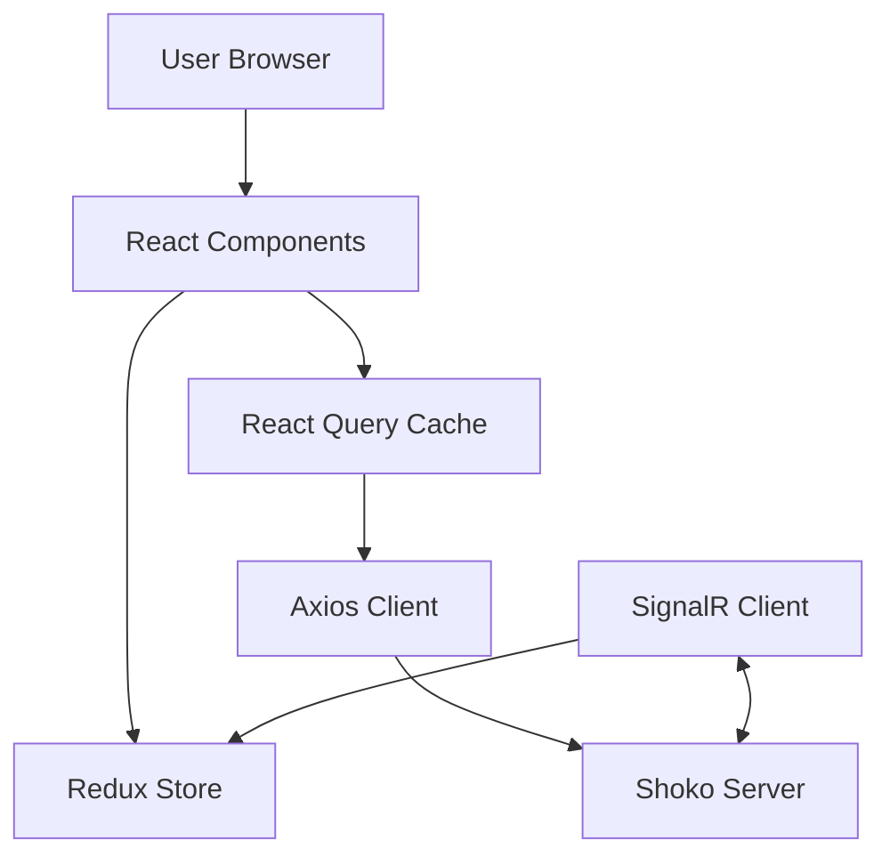

# Project Overview

Shoko WebUI is the modern, React-based frontend interface for the Shoko Anime Management Server. It provides a rich user experience for managing anime collections, configuring server settings, and browsing metadata. The application is built with performance and aesthetics in mind, utilizing Vite for fast development and Redux Toolkit/React Query for robust state management.

## Repository Structure

*   `.github/workflows` – CI/CD configurations for automated releases and linting checks.
*   `build` – Production build output directory.
*   `dist` – Distribution files.
*   `images` – Static image assets.
*   `public` – Static public assets served directly by the web server.
*   `src` – Source code root.
    *   `src/components` – Reusable UI components (buttons, inputs, layout elements).
    *   `src/core` – Core application logic including API clients, Redux store, and React Query configurations.
    *   `src/css` – Global stylesheets and Tailwind configuration.
    *   `src/hooks` – Custom React hooks.
    *   `src/pages` – functional components representing distinct application routes/pages.
*   `eslint.config.mjs` – Flat config for ESLint.
*   `vite.config.mjs` – Configuration for the Vite build tool.

## Build & Development Commands

> **Note:** This project strictly uses `pnpm`. Do not use `npm` or `yarn`.

```bash
# Install dependencies
pnpm install

# Start development server (runs locally at http://localhost:3000)
pnpm start

# Build for production
pnpm build

# Build for debug/dev mode
pnpm build:debug

# Linting and Type Checking verification chain
# Runs: tscheck, dprint check, eslint, and stylelint
pnpm lint

# Fix linting issues automatically
pnpm eslint:fix
pnpm dprint:fix
```

## Code Style & Conventions

*   **Formatting**: Handled by `dprint`. Run `pnpm dprint:fix` to format.
*   **Linting**: strict ESLint configuration based on Airbnb's rules with TypeScript support.
*   **CSS**: Vanilla CSS works alongside Tailwind CSS (configured via `postcss` and `stylelint`).
*   **Naming**:
    *   React Components/Files: PascalCase (e.g., `MyComponent.tsx`).
    *   Hooks: camelCase with `use` prefix (e.g., `useMyHook.ts`).
    *   Utilities/Functions: camelCase.
*   **State Management**:
    *   Use `React Query` (`@tanstack/react-query`) for server state (fetching data).
    *   Use `Redux Toolkit` for complex client-side global state.
    *   Use local state (`useState`) for component-specific UI logic.

## Architecture Notes

**Key Components & Data Flow:**

1.  **Frontend (React)**: The UI layer composed of functional components in `src/pages` and `src/components`.
2.  **State Layer**:
    *   `Redux Store` (`src/core/store.ts`): Manages global UI state.
    *   `React Query` (`src/core/react-query`): Caches and manages server data.
3.  **API Layer** (`src/core`):
    *   Communicates with Shoko Server API via `axios`.
    *   Real-time updates handled via SignalR (`src/core/signalr`).
4.  **Backend (Proxy)**:
    *   During dev, API requests are proxied to `http://localhost:8111` (or custom endpoint) to avoid CORS issues.



## Testing Strategy

> **Status**: Currently, there are no distinct unit or integration tests configured in the repository (e.g., Jest or Vitest).

*   **Type Safety**: TypeScript (`pnpm tscheck`) provides static analysis.
*   **Linting**: Strict linting (`eslint`, `stylelint`) enforces code quality.
*   **Manual Testing**: Development relies on `pnpm start` and manual verification against a live Shoko Server instance.
*   **CI Checks**: GitHub Actions run `Lint-PR` to enforce static analysis on Pull Requests.

## Security & Compliance

*   **Dependencies**: Keep dependencies updated. Use `pnpm audit` to check for vulnerabilities.
*   **Secrets**: Do not commit secrets. Use environment variables (Vite supports `.env` files) if necessary, though this is a client-side app.
*   **Proxy Config**: `proxy.config.js` is used to tunnel requests to the backend securely during development.

## Agent Guardrails

*   **Restricted Files**:
    *   Do NOT modify `pnpm-lock.yaml` manually.
    *   Do NOT modify `eslint.config.mjs` or `.dprint.json` unless explicitly tasked to update toolchains.
*   **Review Policy**: All changes to `src/core` (especially authentication or API handling) require high scrutiny.
*   **Dependency Management**: Always use `pnpm add` / `pnpm remove`. Never use `npm install`.

## Extensibility Hooks

*   **Proxy Settings**: Copy `proxy.config.default.js` to `proxy.config.js` to point the dev server to a different backend instance.
*   **Feature Flags**: Check `src/core` for any feature-flag implementations (currently managed via Redux state or server capabilities).

## Further Reading

*   [README.md](./README.md) – Quick start guide.
*   [package.json](./package.json) – Full list of dependencies and scripts.
