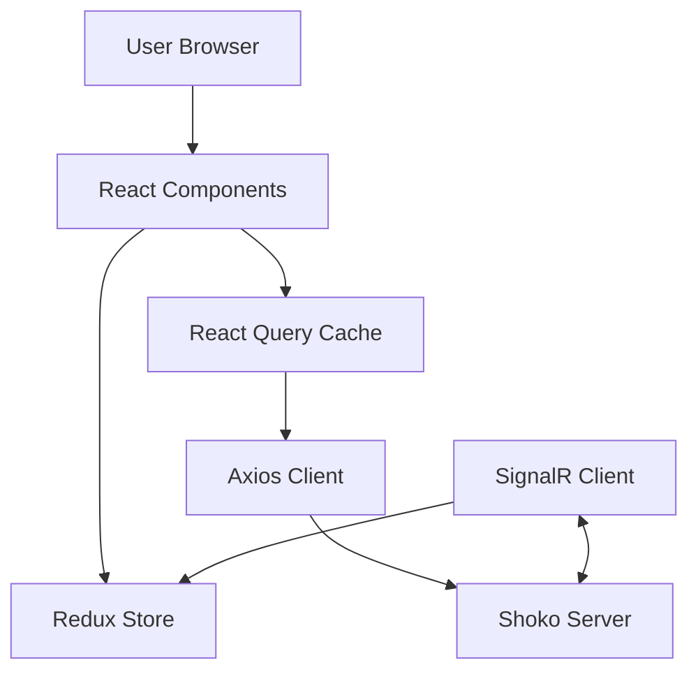

# Shoko WebUI

**Shoko WebUI** is the next-generation frontend for the [Shoko Anime Management Server](https://shokoanime.com/). Built with speed and modern aesthetics in mind, it provides a seamless experience for managing your anime collection, exploring metadata, and configuring your server.


## 🚀 Features

*   **Modern Stack**: Built with [React 19](https://react.dev/), [Vite](https://vitejs.dev/), and [Redux Toolkit](https://redux-toolkit.js.org/).
*   **Fast**: Optimized build times and runtime performance.
*   **Responsive**: Designed to look great on desktop and mobile.
*   **Real-time**: Leverages SignalR for live updates from the server.

## 🛠️ Prerequisites

*   **Node.js**: >=22 (LTS recommended)
*   **Package Manager**: `pnpm` (This project **strictly** uses pnpm. Do not use `npm` or `yarn`.)
*   **Shoko Server**: A running instance of Shoko Server (locally or remote).

## ⚡ Quick Start

1.  **Clone the repository**
    ```bash
    git clone https://github.com/ShokoAnime/Shoko-WebUI.git
    cd Shoko-WebUI
    ```

2.  **Install dependencies**
    ```bash
    pnpm install
    ```

3.  **Start the development server**
    ```bash
    pnpm start
    ```
    Open [http://localhost:3000](http://localhost:3000) to view it in the browser.

## 🏗️ Architecture

The WebUI acts as a client for the Shoko Server API. It manages global state via Redux and caches server data using React Query.



## 💻 Development

### Key Commands

| Command | Description |
| :--- | :--- |
| `pnpm start` | Runs the app in development mode. |
| `pnpm build` | Builds the app for production to the `build` folder. |
| `pnpm lint` | Checks source code with `eslint`, `stylelint`, `dprint`, and `tsc`. |
| `pnpm eslint:fix` | Automatically fixes ESLint errors. |
| `pnpm dprint:fix` | Formats code using dprint. |

### Configuration

If your Shoko server is running on a different machine or port:
1.  Copy `proxy.config.default.js` to `proxy.config.js`.
2.  Edit `proxy.config.js` and set the `target` to your Shoko Server URL (e.g., `http://192.168.1.50:8111`).

## 🤝 Contributing

We are always accepting help, and there are a million little things that always need done. Hop on our [discord](https://discord.gg/vpeHDsg) and talk to us. Communication is important in any team. No offense, but it's difficult to help anyone that shows up out of nowhere, opens 3 issues, then creates a PR without even talking to us. We have a wealth of experience. Let us help you...preferably before the ADHD takes over, you hyperfixate, and you come up with a fantastic solution to problem that isn't at all what you expected. Support is also best found in the discord, in case you read this far.


