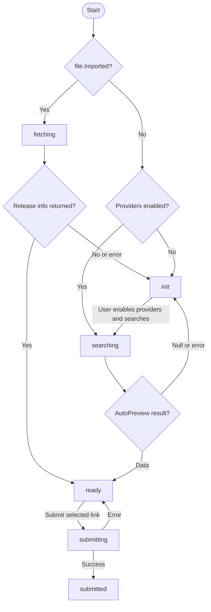

# LinkFilesWithProviders

Top-level utility page at `/webui/utilities/link-with-providers`. Links files to release info using configured providers, or fetches existing release info for already-linked files.

## Entry Points

Files arrive via React Router `location.state.selectedRows` (`FileType[]`):

| Source | Path | Note |
|---|---|---|
| `UnrecognizedTab` | `/webui/utilities/unrecognized/files` | Multi-select, "Link With Providers (beta)" button |
| `UnrecognizedFiles` panel | Dashboard | Single-file, per-row button |
| `FileSearch` | `/webui/utilities/file-search` | "Edit Link" button, multi-select |

All sources navigate: `navigate('/webui/utilities/link-with-providers', { state: { selectedRows } })`.

## File Structure

```
src/pages/utilities/
  LinkFilesWithProviders.tsx     Page component + render + event handlers

src/hooks/utilities/
  useLinkWorkflow.ts             State machine: dispatch, guard sets, drive loop
  useReleaseInfoForm.ts          Form state + touched-field tracking for the Edit Release Info modal

src/core/utilities/
  releaseInfoHelpers.ts          Pure helpers: createLinksFromFiles, mergeReleaseInfo, isUserEdited; shared constants EDITABLE_STATES, AUTO_MATCH_EPISODE_ID, RANGE_FILL_EPISODE_ID
  auto-match-logic.ts            detectShow, findMostCommonShowName

src/core/types/utilities/
  link-files-with-providers.ts    ManualLinkType, ManualLinkProviderType, LinkStateType, CrossReferenceType, RangeFillType, TouchableField

src/components/Utilities/Unrecognized/
  AnimeSelectPanel.tsx           Shared AniDB series search panel (modal + LinkFilesTab)
  RangeFillModal.tsx             Range fill options modal (episode type + starting number)

  LinkFilesWithProvider/
    LinkCard.tsx                 Per-link card (state-driven styling, selection)
    ProviderName.tsx             Status text per state
    Menu.tsx                     Action bar (Search, Edit, Submit, etc.)
    TitleOptions.tsx             Header counts (submitted/pending/total/selected)
    AutoSearchReleaseModal.tsx   Provider picker modal
    SelectReleaseGroup.tsx       Searchable release-group combobox
    EditReleaseInfoModal.tsx     Edit release metadata for selected links
    SelectedFilesModal.tsx       Nested "Selected Files" list modal (opened from Edit Release Info header)
```

## Key Types

```ts
type LinkStateType = 'init' | 'searching' | 'ready' | 'submitting' | 'submitted' | 'fetching';

type ManualLinkProviderType = { id: string; enabled: boolean };

type ManualLinkType = {
  id: number;
  file: FileType;
  providers: ManualLinkProviderType[];
  release: ReleaseInfoType;
  state: LinkStateType;
};
```

Each link's `state` field drives the entire workflow — the component never directly calls process handlers, only the drive loop dispatches based on current state.

The Edit Release Info modal adds three shared types:

```ts
type CrossReferenceType = {
  seriesId: number;
  episodeId: number;
  episodes: AniDBEpisodeType[];
  rangeFill?: RangeFillType;
};

type RangeFillType = {
  episodeType: EpisodeTypeValues;
  rangeStart: number;
};

type TouchableField = 'Comment' | 'CrossReferences' | 'Group' | 'IsChaptered' | 'IsCreditless' | 'Source' | 'Version';
```

## State Groups

Two constants replace repeated arrays across the workflow. `EDITABLE_STATES` lives in `releaseInfoHelpers.ts` so `Menu` and the page share it; `BUSY_STATES` remains page-local.

| Name | Values | Guards |
|---|---|---|
| `BUSY_STATES` | `searching, submitting, fetching` | Blocks removal and select-all; Escape cancels active work |
| `EDITABLE_STATES` | `ready, init` | Enables search, provider update, and release info editing |

## State Machine

The workflow is state-driven:



### State Reference

| State | UI | Meaning |
|---|---|---|
| `init` | `text-warning` | Waiting for user to configure providers |
| `searching` | `animate-pulse cursor-wait` | AutoPreview in progress |
| `fetching` | `animate-pulse cursor-wait` | Fetching existing release info for already-linked files |
| `ready` | `cursor-pointer` | Awaiting user submission |
| `submitting` | `cursor-progress` | Submitting release info to server |
| `submitted` | — | Finished |

### Process Handlers

All handlers are `useEffectEvent` callbacks inside `useLinkWorkflow`. Each gates on a guard Set (`inFlight.current.*`) to prevent duplicate in-flight API calls, adds the link ID before calling, and removes it in `finally`.

### `processSearch`

1. Filters enabled providers from `link.providers`
2. If none enabled → clears the guard and → `init`
3. Calls `POST ReleaseInfo/File/{id}/AutoPreview?providerIDs=...`
4. On null result → `init`
5. On data → merges result via `mergeReleaseInfo(incoming, link.release)` → `ready`
6. On error → `init`

### `processSubmit`

Calls `POST ReleaseInfo/File/{id}` with `link.release` body. Success → `submitted`, error → `ready`.

### `processLinked`

1. Calls `GET ReleaseInfo/File/{id}` to fetch existing release info
2. On null (no existing release info) → `init`
3. On data → stores fetched release → `ready`
4. On error → `init`

### `cancelActiveWork`

Flips busy states back to idle when the user presses Escape: `submitting` → `ready`, `searching`/`fetching` → `init`. Does NOT clear guard Sets — in-flight API calls complete naturally, and their callbacks will overwrite state harmlessly.

## Helpers (`releaseInfoHelpers.ts`)

### `createLinksFromFiles(files, providers)`

Converts `FileType[]` into `Record<number, ManualLinkType>`:

1. Sorts files by `RelativePath` of the first accessible location (falling back to the first location) — natural, case-insensitive, numeric, ignoring punctuation
2. For each file, builds a seed `ReleaseInfoType`:
   - `OriginalFilename` from last path segment
   - `ProviderName: 'User'`, `Source: Unknown`
   - `FileSize`, `Hashes` from file
   - `Released` date from `MediaInfo.Encoded` or `file.Created`
3. Checks `file.Imported`:
   - **truthy** → `providers: []`, `state: 'fetching'` (will call GET ReleaseInfo)
   - **falsy** → `providers` from settings, `state: 'searching'` (if any provider is enabled) or `'init'`

### `mergeReleaseInfo(incoming, original)`

Merges AutoPreview result into the user's seed release. Preserves user-set fields via nullish coalescing (`FileSize`, `OriginalFilename`, `IsChaptered`, `IsCensored`, `IsCreditless`, `Group`), restores `Source` from the original only when the incoming `Source` is `Unknown`, enforces `Version >= 1`, and appends `+User` to `ProviderName` unless `isUserEdited` reports it as already user-edited.

### `isUserEdited(providerName)`

Returns whether `User` is one of the providers in the `+`-joined `ProviderName` chain (e.g. `AniDB+User`, `User+AniDB`, `AniDB+User+TestProvider`). Shared by `mergeReleaseInfo`, `handleSaveReleaseInfo`, and `ProviderName` to detect user edits consistently.

## API Endpoints

| Endpoint | Method | Used by | Purpose |
|---|---|---|---|
| `ReleaseInfo/Provider` | GET | Component | Fetch available providers |
| `ReleaseInfo/File/{id}/AutoPreview?providerIDs=...` | POST | `processSearch` | Search enabled providers |
| `ReleaseInfo/File/{id}` | GET | `processLinked` | Fetch existing release info |
| `ReleaseInfo/File/{id}` | POST | `processSubmit` | Submit release info |

## Edit Release Info Modal

Opened from the Menu's "Edit Release Info" action (`E`) for the selected links. Two-step flow:

1. **Series search** — a shared `AnimeSelectPanel` (debounced AniDB search) when no series is selected.
2. **Review form** — once a series is chosen (or when bulk-selecting mixed series), shows series + episode selection and the release fields.

The header shows the selected file count alongside an info button (`mdiInformationOutline`). For a single file the button's tooltip is the filename; for multiple files it opens a nested `SelectedFilesModal` (tooltip "Show files"). The modal lists each file's managed-folder name, parent directory (or `Root Level`), and filename, with the full `RelativePath` in a hover tooltip.

Editable fields: `Version`, `Source`, `IsChaptered`, `IsCreditless`, `Comment`, and `Release Group`. The release group is a searchable `SelectReleaseGroup` combobox that filters known groups by name/shortname and only shows options while typing; typing an unknown name offers a `Create "…"` option that sets the group's `Name`, `ShortName`, and `ID` to the typed value with `Source: User`. Episode selection includes an "Auto-match (from filename)" option (`AUTO_MATCH_EPISODE_ID = -1`) and, directly below it, a "Range Fill" option (`RANGE_FILL_EPISODE_ID = -2`), whose label reads "Range Fill (from S3)" once a range is configured (episode prefix via `getEpisodePrefix` + starting number) and "Range Fill (not set)" otherwise. Selecting "Range Fill" (from the dropdown or via the `r` hotkey) automatically opens the `RangeFillModal` (episode type + starting number); a pencil edit button, shown only while "Range Fill" is selected, reopens it. On save, consecutive episodes of the chosen type are assigned to the selected files in sorted order. When selected files have differing episode links, the selector shows a disabled "Multiple episodes selected" entry and those per-file links are preserved unless an episode (or auto-match/range-fill) is explicitly chosen; the release group field shows "Multiple groups selected" for mixed groups. Save is gated by a `saveDisabled` flag (`!show`, no touched fields, or "Range Fill" selected without a configured range) that disables the Save button and is also checked at the top of `handleSave` so `Enter` triggers save safely.

State is managed by the `useReleaseInfoForm` hook (form state, touched-field tracking, mixed-selection flags). Clearing the release group or comment and leaving the field removes the stored value on save — `setIfTouched` uses a `writeUndefined` option so an empty value is omitted from the payload and cleared server-side. On save, `handleSaveReleaseInfo` in the page merges the patch into each selected link's `release`, resolves the episode cross-reference (auto-match resolves via `detectShow` → matching episode, writing `CrossReferences` at 0–100%), and appends the `+User` marker to `ProviderName` (unless `isUserEdited`). The per-link mutation (apply the `releaseInfo` patch, write `CrossReferences`, append `+User`, transition to `ready`) lives in a local `applyRelease(link, episodeId)` helper shared by the auto-match/single-episode and range-fill branches. A link's state is set to `ready` only when a cross-reference is actually resolved (a concrete `episodeId` is written); when no `crossReference` was provided, or auto-match fails to find an episode, the link keeps its previous state (no `ready` transition). Failed auto-matches — where a `crossReference` was present but resolution failed — are reported in an error toast with the file count. For range fill, the selected links are iterated in sorted (`RelativePath`) order and each gets the next consecutive episode of the chosen type starting from the configured number; if the episode queue runs out before all selected files are processed, a warning toast reports how many files could not be filled.

### Modal Hotkeys

The Edit Release Info modal registers `Esc` (close), `R` (select "Range Fill", gated on a selected series), and `Enter` (save) in the `modal` scope. While the nested `RangeFillModal` is open, `useToggleModalKeybinds(show && !showRangeFill, 'modal')` suspends the `modal` scope so its shortcuts don't fire.

The `RangeFillModal` runs in the `nested-modal` scope with `Esc` (cancel) and `Enter` (fill). Its Fill button is disabled until a positive starting number is entered, and `Enter` inside the "Range Starting Number" input also fills via the input's `onKeyUp` handler. Guards such as `saveDisabled` and `!show || !formState.selectedSeriesId` live inside the handlers themselves (`handleSave`, `handleEpisodeSelect`) rather than in the hotkey callbacks.

## Supporting Components

- **`LinkCard`** — Per-link card. Border color reflects state (`submitted` → important, `searching`/`submitting` → primary, `ready` → warning). Click-to-select disabled for busy states (`searching`/`submitting`/`fetching`).
- **`ProviderName`** — Status text per state (`"Retrieving existing release info..."` for `fetching`, etc.). Appends "(Edited by User)" when `User` is part of the `+`-joined `ProviderName` chain (via `isUserEdited`).
- **`Menu`** — Action bar. "Search for Release Info" and "Edit Release Info" enable when all selected links are in `EDITABLE_STATES` (`ready`/`init`); "Remove Selected" and "Submit Selected" render conditionally. Hotkeys are registered on the page: `S` search, `A` select-all, `D` remove, `E` edit, `Q` submit, `Esc` cancel, `Enter` submit. A `useToggleModalKeybinds(!confirmCancel, 'primary')` call re-enables this `primary` scope when the abort-linking confirmation modal closes, so page shortcuts work again.
- **`TitleOptions`** — Header showing `{submitted} / {submitted + pending} Submitted | {total} Files | {selected} Selected`. Only `ready` and `submitting` count as pending; `init`, `searching`, and `fetching` do not.
